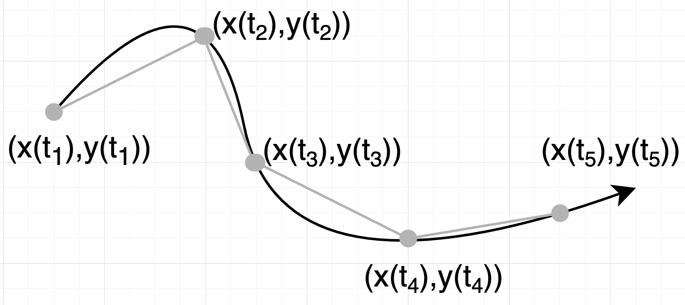

## Die Atomidee

- Was passiert, wenn man Materie immer wieder teilt?
- Entsteht am Ende etwas Unteilbares (oder ist Materie kontinuierlich teilbar)?
- Atomos: Das Unteilbare (Demokrit)
- Atome bestehen aus Protonen, Elektronen und Neutronen
- Elementarteilchen
- Unteilbar heisst, dass man viel Energie benötigt, um ein Teilchen zu teilen
- Lassen sich Elementarteilchen weiter teilen?

## Der Aufbau der Materie aus Teilchen/Partikeln

> Als Teilchen werden die Objekte verstanden, die sich während des betrachteten Prozesses nicht teilen.

- Elementarteilchenphysik
Hydromechanik: Wassermolekühle
- Stossmechanik: Billardkugeln
- Empirische Sozialeforschung: Mengschen
- Verkehrswesen: Fussgänger, Fahrradfarer, Autos
- Transportwesen: Container
- Astononomie: Himmelskörper

## Der Aggregatzustand fest
```
=========================   =========================
|                       |   |                       |   
|          xx           |   |                       |   
|          xx           |   |                       |
|                       |   |                       |
|                       |   |     xx                |
|                       |   |     xx                |
=========================   =========================
```

## Der Aggregatzustand flüssig
```
=========================   =========================
|                       |   |                       |   
|          xx           |   |                       |   
|           xx          |   |                       |
|                       |   |                       |
|                       |   |                 xx    |
|                       |   |                  xx   |
=========================   =========================
```

## Der Aggregatzustand gasförmig
```
=========================   =========================
|     x      x        x |   |   x     x         x   |   
|   x      x      x     |   |x     x     x          |   
|           x          x|   |    x    x      x      |
|        x        x     |   | x          x          |
|    x     x         x  |   |      x           x    |
|      x       x        |   |  x         x         x|
=========================   =========================
```

## Trajektorie oder Bahnen eines Teilchens



## Das Schicksal der Welt: Die Bahnen aller Teilchen

## Graphische Darstellung einer Bahnlinie