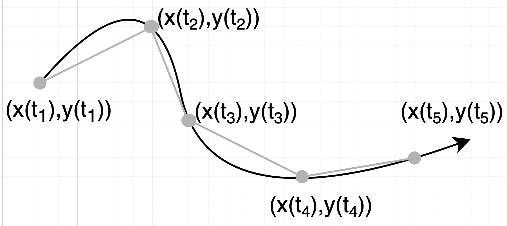

## Das Teilchenbild

- Die Welt besteht aus N Teilchen.
- N ist sehr, sehr gross.
- Die Teilchen bewegs sich durch den Raum
- Diese bzw. Bewegung im Allgemeinen wollen wir beschreiben.

## Definition der Geschwindigkeit

Geschwindigkeit ist der in einer Zeitspanne zurückgelegte Weg.

$$
v = \frac{\Delta s}{\Delta t}
$$

Einheiten: m/s, km/h

## Die Geschwindigkeit als vektorielle Grösse

$$
U = \frac{x_2 - x_1}{t_2 - t_1} = \frac{\Delta x}{\Delta t}
$$

$$
V = \frac{y_2 - y_1}{t_2 - t_1} = \frac{\Delta y}{\Delta t}
$$

$$
W = \frac{z_2 - z_1}{t_2 - t_1} = \frac{\Delta z}{\Delta t}
$$

## Die Geschwindigkeit als differentielle vektorielle Grösse

$$
u = \lim_{\Delta t\to\infty} \frac{x_2 - x_1}{t_2 - t_1} = \frac{dx}{dt}
$$

$$
v = \lim_{\Delta t\to\infty} \frac{y_2 - y_1}{t_2 - t_1} = \frac{dy}{dt}
$$

$$
w = \lim_{\Delta t\to\infty} \frac{z_2 - z_1}{t_2 - t_1} = \frac{d}{dt}
$$

## Von der Geschwindigkeit zur Bahnlinie

$$
u = \frac{dx}{dt} \hspace{20mm} x(t) = x_0 + \int_{0}^{t} u(t)dt
$$

$$
v = \frac{dy}{dt} \hspace{20mm} y(t) = y_0 + \int_{0}^{t} v(t)dt
$$

$$
w = \frac{d}{dt} \hspace{20mm} z(t) = z_0 + \int_{0}^{t} u(t)dt
$$

## Die gradlinige gleichförmige Bewegung
> Spezialfall

$$
u(t) = u_0 \hspace{20mm} x(t) = x_0 + \int_{0}^{t} u_0dt = x_0 + u_0t
$$

$$
v(t) = 0 \hspace{20mm} y(t) = y_0 + \int_{0}^{t} 0dt = y_0
$$

$$
w(t) = 0 \hspace{20mm} z(t) = z_0 + \int_{0}^{t} 0dt = z_0
$$

## Das xt-Diagramm

$x_(t) = x_0 + u_0t$

## Numberische Lösungen 

$$
\frac{dx}{dt} = u(t)
$$

$$
\frac{dy}{dt} = v(t)
$$

$$
\frac{dz}{dt} = w(t)
$$

## Eine Kreisbewegung?

$$
u(t) = u_0 cos(\omega t
$$

$$
v(t) = v_0 sin(\omega t
$$

---

## Beschleunigung

- Geschwindigkeit ändern sich.
- Die Geschwindigkeitsänderung pro Zeit ist die Beschleunigung.
- Bremsen ist eine negative Beschleunigung.

$$
u = \frac{dx}{dt} \hspace{20mm} a_x(t) = \frac{du(t)}{dt}
$$

$$
u = \frac{dy}{dt} \hspace{20mm} a_y(t) = \frac{dv(t)}{dt}
$$

$$
u = \frac{dz}{dt} \hspace{20mm} a_z(t) = \frac{dw(t)}{dt}
$$

## Von der Beschleunigung zur Bahnlinie

Bahnlinie
$$
x(t) = x_0 + \int_{0}^{t} u(t)dt
$$

Geschwindigkeit
$$
u(t) = u_0 + \int_{0}^{t} a_x(t)dt 
$$

Einsetzen von Geschwindigkeit in Bahnline

$$
x(t) = x_0 + \int_{0}^{t} (a_x(t)dt)dt
$$

Geschwindigkeit integrieren

$$
x(t) = x_0 + u_0(t-t_0)+ \int_{0}^{t} (\int_{0}^{t} a_x(t)dt)dt 
$$

---

$$
x(t) = x_0 + u_0(t-t_0)+ \int_{0}^{t} (\int_{0}^{t} a_x(t)dt)dt 
$$

$$
y(t) = y_0 + v_0(t-t_0)+ \int_{0}^{t} (\int_{0}^{t} a_y(t)dt)dt 
$$

$$
z(t) = z_0 + w_0(t-t_0)+ \int_{0}^{t} (\int_{0}^{t} a_z(t)dt)dt 
$$

## Konstante Beschleunigung

$$
x(t) = x_0 + u_0(t-t_0)+ \int_{0}^{t} (\int_{0}^{t} a_x(t)dt)dt 
$$

$$
x(t) = x_0 + u_0(t-t_0)+ \int_{0}^{t} a_x(t-t_0)dt
$$

$$
x(t) = x_0 + u_0(t-t_0) + \frac{1}{2} a_x(t-t0)^2
$$

## Das Schicksal der Welt: Die Beschleunigungen aller Partikel

$$
x_i(t) = x_{0,i} + u_{0,i} (t - t_0) + \int_{0}^{t}(\int_{0}^{t} a_{a,i}(t)dt)dt
$$

$$
y_i(t) = y_{0,i} + v_{0,i} (t - t_0) + \int_{0}^{t}(\int_{0}^{t} a_{a,i}(t)dt)dt
$$

$$
z_i(t) = z_{0,i} + w_{0,i} (t - t_0) + \int_{0}^{t}(\int_{0}^{t} a_{a,i}(t)dt)dt
$$

---

## Fallgesetze heute: Die gleichförmig beschleunigte Bewegung

$$
g = const = 9.81\frac{m}{s^2} 
$$

$$
v = gt
$$

$$
s = \frac{1}{2}gt^2
$$

## Die Fallgeschwindigkeit

$$
v = gt \hspace{20mm} s = \frac{1}{2}gt^2
$$

$$
2h = g(\frac{v}{g})^2
$$

$$
v = \sqrt{2gh}
$$

## Vom Weg zur Beschleunigung

$$
s = s(t)
$$

Ableiten

$$
v = \frac{ds}{dt}
$$

Ableiten

$$
a = \frac{dv}{dt}
$$

## Von der Beschleunigung zum Weg

$$
a(t)
$$

Integrieren

$$
v(t) = v_0 + \int_{t_0}^{t} a(t) dt
$$

Integrieren

$$
s(t) = s_0 + \int_{t_0}^{t} v(t) dt
$$

## Spezialfall: Konstante (Erd-)Beschleunigung

$$
v(t) = v_0 + \int_{t_0}^{t} gdt = v_0 + g(t-t_0)
$$

$$
s(t) = s_0 + \int_{t_0}^{t} (v_0 + g(t - t_0)) dt
$$

$$
s(t) = s_0 + v_0(t - t_0) + \frac{1}{2} g(t - t_0)^2
$$

$$
s = \frac{1}{2}gt^2 \hspace{20mm} v=gt
$$

## Was ist der freie Fall?

1. Erdbeschleunigung
2. Strömungswiderstand
3. Zeitablauf (Dynamik)